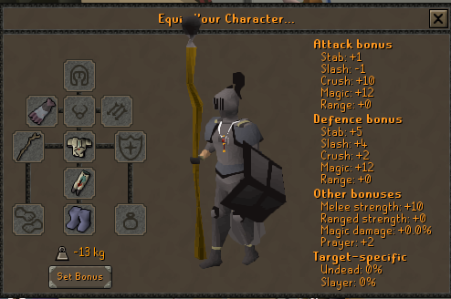

# Cosmetics Network
A plugin for setting up some cosmetic appearance for yourself that every other user with the plugin can see.

# Using the plugin
Once the plugin is enabled, it will query for the costumes of other players and apply them as needed.

In order to set your own cosmetics:  
1. Disable the plugin.
2. Equip whatever you want your cosmetic appearance to be.  
3. Enter the settings menu of the Cosmetics plugin.  
4. Toggle the `Save Now` option.  
5. Turn the plugin back on.  

This will save your cosmetics data and will become visible to everyone else using the plugin within five minutes.

# Layout

Note that this branch is the branch for the plugin itself. The [db](https://github.com/JohnathonNow/runelite-cosmetic-network/tree/db)
branch contains the source code for the backend that stores the cosmetics of every player.
